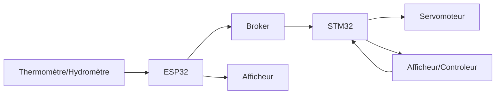
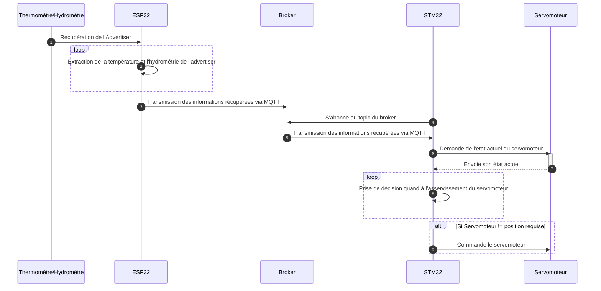

# Projet Domotique

## Contexte

Dans l'optique d'assimiler les concepts d'environnements intelligents et communiquants, un cas de test de type "domotique" a été retenu.   
L'objectif est dans mettre en oeuvre une version simple et allegée d'un système domotique domestique.  
Le système devra comprendre la lecture d'un capteur de température et d'hydrométrie pour ensuite commander l'asservissement d'une bouche d'aération que l'on pourrait retrouver dans une salle d'eau par exemple.  

## Contexte
(cf : Schéma de principe et Schéma d'architecure)
Dans notre système, le termomètre/hydromètre (TH) contiendra les valeurs d'humidité et de température ambiante. Ces éléments sont récupérés par Bluetooth par l'ES32 qui pourra alors les afficher sur son propre afficheur. Ces données, destinées au STM32 vont être publiés sur les topics du même nom par l'intermédiaire du Broker. De ce fait, une fois abonné au Topic, la carte STM32 pourra récuperer les valeurs. Il ne restera plus qu'a commander le servomoteur en fonction des directives utilisateurs en comparaison aux données environnementales récupérées. 

## Schéma d'architecture

## Schéma de Principe

## ESP32 : Introduction
Afin de traiter cette partie, il est necessaire d'utiliser l'extension PlateformeIO pour VisualCode. L'objectif va etre de publier sur le topic dédié les informations de température et d'humidité issues du capteur Bluetooth. 

## ESP32 : Récupération de la température et de l'humidité

## ESP32 : Communication Wifi

## ESP32 : Transmission MQTT

## Le Broker

## STM32 : Introduction
Les données sont maintenant récupérables par le STM32 en s'abonnant au topic correspondant. Au moyen de MQTT, la question va être de s'abonner au topic. 

## STM32 : Reception MQTT

## STM32 : Affichage

## Le Servomoteur

## Erreurs à éviter

Il est indispensable de penser à purger les variables à chaque fois. Sans cette précaution, les valeurs retournées seront aléatoires et engendreront donc des erreurs lors de la communication. 

Dans le cas où la même adresse MAC se retrouverait sur plusieurs cartes dans le réseau du broker, des erreurs seront inévitables. Il est indispensable de modifier les adresses MAC choisies afin d'être certains de l'unicité de chacune. 