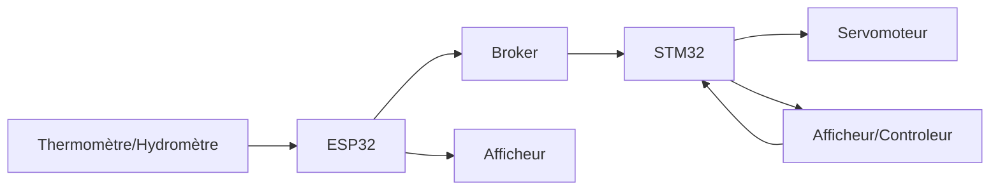
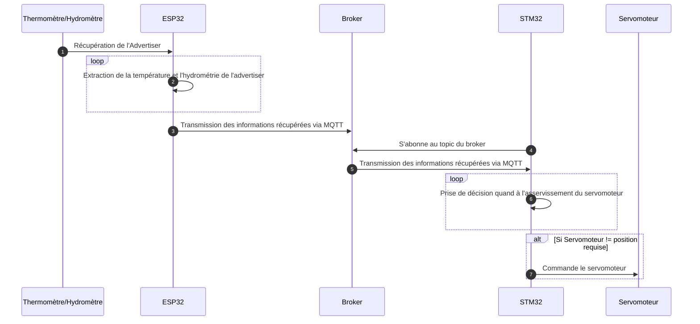

<script>
    mermaid.initialize({
    sequence: { showSequenceNumbers: true },
    });
</script>
# Projet Domotique

## Contexte

Dans l'optique d'assimiler les concepts d'environnements intelligents et communiquants, un cas de test de type "domotique" a été retenu.   
L'objectif est dans mettre en oeuvre une version simple et allegée d'un système domotique domestique.  
Le système devra comprendre la lecture d'un capteur de température et d'hydrométrie pour ensuite commander l'asservissement d'une bouche d'aération que l'on pourrait retrouver dans une salle d'eau par exemple.  

## Contexte
(cf : Schéma de principe et Schéma d'architecure)
Dans notre système, le termomètre/hydromètre (TH) contiendra les valeurs d'humidité et de température ambiante. Ces éléments sont récupérés par Bluetooth par l'ES32 qui pourra alors les afficher sur son propre afficheur. Ces données, destinées au STM32 vont être publiés sur les topics du même nom par l'intermédiaire du Broker. De ce fait, une fois abonné au Topic, la carte STM32 pourra récuperer les valeurs. Il ne restera plus qu'a commander le servomoteur en fonction des directives utilisateurs en comparaison aux données environnementales récupérées. 


## Schéma d'architecture



## Schéma de Principe



## ESP32 : Introduction
Afin de traiter cette partie, il est necessaire d'utiliser l'extension PlateformeIO pour VisualCode. L'objectif va etre de publier sur le topic dédié les informations de température et d'humidité issues du capteur Bluetooth. 

L'application est codée en C++

## ESP32 : Récupération de la température et de l'humidité

Les données du capteur (température et humidité) sont récupérées à partir de sa trame d'annonce (advertasing).
Le capteur envoie 3 trames d'annonce différentes :
- Avec l'humidité
- Avec la témpérature
- Avec l'humidité et la température (c'est celle ci qui est utilisé)

Dans ces trames : 
le 18e octet permet de différencier quelle type de trame à été reçu.

Dans le cas ou cet octet contient la valeur héxadécimal : 0d il s'agit de la trame contenant la température et l'humidité.

On peut récupérer ces données avec les formules suivantes 

- Température : (trame[22] * 256 + trame[21]) / 10
- Humidité : (trame[24] * 256 + trame[23]) / 10


## ESP32 : Communication Wifi

L'initialisation du WIFI se fait à partir de la librairie MQTT [EspMQTTClient](https://github.com/plapointe6/EspMQTTClient)  


```cpp
#include "EspMQTTClient.h"
#include <string>


const std::string wifi_ssid = "ASUS";
const std::string wifi_passphrase = "astro4student";

EspMQTTClient mqtt(
    wifi_ssid.c_str(),
    wifi_passphrase.c_str(),
    "192.168.1.94", // MQTT Broker server ip
    "ESP-JGD-OPT",  // Client name that uniquely identify your device
    1883            // The MQTT port, default to 1883. this line can be omitted
);

```


## ESP32 : Transmission MQTT

L'envoi de données est fait grâce à la librairie

```cpp

const std::string topic = "Temperature";
const std::string str_val = "20";
mqtt.publish(topic, str_val); // envoi sur le topic "Temperature" de la valeur "20" en ASCII

```


## Le Broker MQTT

Le broker est l'élément central d'une architecture MQTT, il s'agit du serveur réceptionnant les `publish` et les demandes de `subscribe` des autres noeux MQTT.

Il est démarré à partir d'un conteneur docker [Mosquitto](https://hub.docker.com/_/eclipse-mosquitto) lancé sur l'une de nos machines.

Le port par défaut pour le MQTT est `1883` (sans TLS).

## STM32 : Introduction

Les données sont maintenant récupérables par le STM32 en s'abonnant au topic MQTT correspondant.  

## STM32 : Reception MQTT

> Utilisation de la librairie MQTT de [LWIP](https://www.nongnu.org/lwip/2_0_x/group__mqtt.html)

Initialisation : 

Connexion :

Abonnement sur le topic : 

Traitement des data :


Gestion des erreurs


## STM32 : Affichage

## Le Servomoteur


## Erreurs à éviter

Il est indispensable de penser à purger les variables, struct à chaque fois. Sans cette précaution, les valeurs retournées seront aléatoires et engendreront donc des erreurs lors de la communication. 

Dans le cas où la même adresse MAC se retrouverait sur plusieurs cartes dans le réseau du serveur DHCP, des erreurs seront inévitables. Il est indispensable de modifier les adresses MAC choisies afin d'être certains de l'unicité de chacune. 
