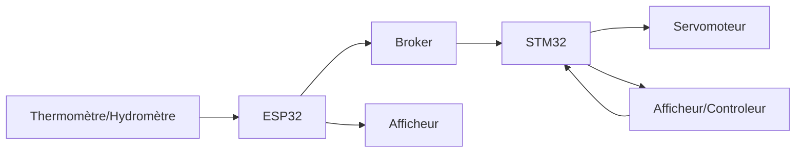
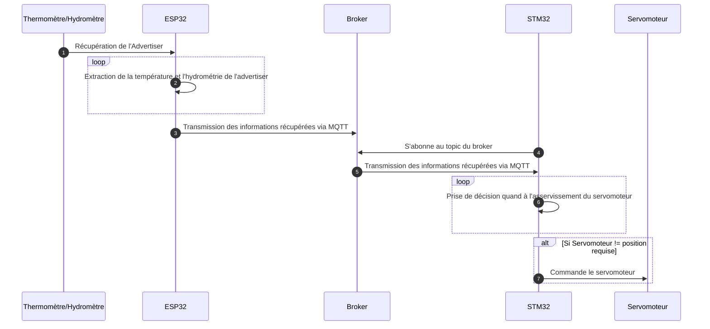

<script>
    mermaid.initialize({
    sequence: { showSequenceNumbers: true },
    });
</script>
# Projet Domotique
Lien de la vidéo : https://youtu.be/UyaJArbsx2s

## Objectifs

Dans l'optique d'assimiler les concepts d'environnements intelligents et communiquants, un cas de test de type "domotique" a été retenu.   
L'objectif est dans mettre en oeuvre une version simple et allegée d'un système domotique domestique.  
Le système devra comprendre la lecture d'un capteur de température et d'hydrométrie pour ensuite commander l'asservissement d'une bouche d'aération que l'on pourrait retrouver dans une salle d'eau par exemple.  

## Contexte
(cf : Schéma de principe et Schéma d'architecure)
Dans notre système, le termomètre/hydromètre (TH) contiendra les valeurs d'humidité et de température ambiante. Ces éléments sont récupérés par Bluetooth par l'ES32 qui pourra alors les afficher sur son propre afficheur. Ces données, destinées au STM32 vont être publiés sur les topics du même nom par l'intermédiaire du Broker. De ce fait, une fois abonné au Topic, la carte STM32 pourra récuperer les valeurs. Il ne restera plus qu'a commander le servomoteur en fonction des directives utilisateurs en comparaison aux données environnementales récupérées. 


## Schéma d'architecture



## Schéma de Principe



## ESP32

### ESP32 : Introduction
Afin de traiter cette partie, il est necessaire d'utiliser l'extension PlateformeIO pour VisualCode. L'objectif va etre de publier sur le topic dédié les informations de température et d'humidité issues du capteur Bluetooth. 

L'application est codée en C++

### ESP32 : Récupération de la température et de l'humidité

Les données du capteur (température et humidité) sont récupérées à partir de sa trame d'annonce (advertasing).
Le capteur envoie 3 trames d'annonce différentes :
- Avec l'humidité
- Avec la témpérature
- Avec l'humidité et la température (c'est celle ci qui est utilisé)

Dans ces trames : 
le 18e octet permet de différencier quelle type de trame à été reçu.

Dans le cas ou cet octet contient la valeur héxadécimal : 0d il s'agit de la trame contenant la température et l'humidité.

On peut récupérer ces données avec les formules suivantes 

- Température : (trame[22] * 256 + trame[21]) / 10
- Humidité : (trame[24] * 256 + trame[23]) / 10


### ESP32 : Communication Wifi

L'initialisation du WIFI se fait à partir de la librairie MQTT [EspMQTTClient](https://github.com/plapointe6/EspMQTTClient)  


```cpp
#include "EspMQTTClient.h"
#include <string>


const std::string wifi_ssid = "ASUS";
const std::string wifi_passphrase = "astro4student";

EspMQTTClient mqtt(
    wifi_ssid.c_str(),
    wifi_passphrase.c_str(),
    "192.168.1.94", // MQTT Broker server ip
    "ESP-JGD-OPT",  // Client name that uniquely identify your device
    1883            // The MQTT port, default to 1883. this line can be omitted
);

```


### ESP32 : Transmission MQTT

L'envoi de données est fait grâce à la librairie

```cpp

const std::string topic = "Temperature";
const std::string str_val = "20";
mqtt.publish(topic, str_val); // envoi sur le topic "Temperature" de la valeur "20" en ASCII

```


## Le Broker MQTT

Le broker est l'élément central d'une architecture MQTT, il s'agit du serveur réceptionnant les `publish` et les demandes de `subscribe` des autres noeux MQTT.

Il est démarré à partir d'un conteneur docker [Mosquitto](https://hub.docker.com/_/eclipse-mosquitto) lancé sur l'une de nos machines.

Le port par défaut pour le MQTT est `1883` (sans TLS).

## STM32

### STM32 : Introduction

Les données sont maintenant récupérables par le STM32 en s'abonnant au topic MQTT correspondant.  

### STM32 : Reception MQTT

Utilisation de la librairie MQTT de [LWIP](https://www.nongnu.org/lwip/2_0_x/group__mqtt.html)

Initialisation : 

L'utilisation de MQTT ne doit pas être bloquante pour les autres parties de l'application (gestion de la stack ethernet + dhcp) par conséquent, une thread à été mise en place comme suit :

```c
osThreadDef(MQTT, mqtt, osPriorityLow, 0, configMINIMAL_STACK_SIZE); // Definition du thread nommé MQTT avec une priorité inférieure à celle du DHCP 
osThreadCreate(osThread(MQTT), NULL);
```

Connexion :

```c
void connect_mqtt(mqtt_client_t *client)
{
	struct mqtt_connect_client_info_t ci;

	/* Setup an empty client info structure */
	memset(&ci, 0, sizeof(ci));

	/* Minimal amount of information required is client identifier, so set it here */
	ci.client_id = "JGD-OPT"; // Identifiant "unique" du device sur le réseau MQTT
	ip_addr_t ip_addr;
	IP4_ADDR(&ip_addr, 192,168,1,94); // Adresse du broker (serveur) MQTT 


	mqtt_client_connect(client, &ip_addr, MQTT_PORT, mqtt_connection_cb, 0, &ci);

	for ( ;; ) { // Boucle infinie forçant le thread à rester actif
		osDelay(200);  // Sleep fait par l'OS afin que notre thread rende la main aux autres thread (DHCP par exemple 
	}
}
```


Abonnement sur le topic : 

Une fois la connexion effectuée, nous voulons nous abonner à plusieurs topics : 
```c

static void mqtt_connection_cb(mqtt_client_t *client, void *arg, mqtt_connection_status_t status)
{
	err_t err;

	if (status == MQTT_CONNECT_ACCEPTED) // Si la connexion c'est bien passée
	{

		err = mqtt_subscribe(client, "JGD-OPT_temperature", 0, NULL, arg); // Inscription sur le topic JGD-OPT_temperature
		err = mqtt_subscribe(client, "JGD-OPT_humidity", 0, NULL, arg); // Inscription sur le topic JGD-OPT_humidity
		mqtt_set_inpub_callback(client, mqtt_incoming_publish_cb, mqtt_incoming_data_cb, arg); // Affectation des callbacks appelé lors de la reception d'un message sur un topic
	}
	else
	{
		LCD_UsrLog((char *)"mqtt_connection_cb: Disconnected, reason: %d\n", status);

		/* Its more nice to be connected, so try to reconnect */
		example_do_connect(client);
	}
}
```


Traitement des data :

La librairie ne nous permet pas d'avoir un callback spécifique pour chaque topic, c'est à nous de gérer au niveau applicatif ce qu'on doit faire :

Pour cela, une variable `inpub_id` va garder en mémoire sur quel topic nous recevons des données

```c

enum {
	TOPIC_TEMPERATURE,
	TOPIC_HUMIDITY
};

static int inpub_id;


// Fonction appelée lors d'un nouveau message sur un topic écouté
// Elle contient le topic concernée
// Elle ne contient pas les données
static void mqtt_incoming_publish_cb(void *arg, const char *topic, u32_t tot_len)
{

  /* Decode topic string into a user defined reference */
  if(strcmp(topic, "JGD-OPT_temperature") == 0) { // si le topic est "JGD-OPT_temperature"
    inpub_id = TOPIC_TEMPERATURE;
  }
    /* Decode topic string into a user defined reference */
  if(strcmp(topic, "JGD-OPT_humidity") == 0) { // si le topic est "JGD-OPT_humidity"
    inpub_id = TOPIC_HUMIDITY;
  }  
}

// Fonction appelée lors d'un nouveau message sur un topic écouté (après mqtt_incoming_publish_cb)
// Elle ne contient pas le topic concernée
// Elle contient les données (data)
static void mqtt_incoming_data_cb(void *arg, const u8_t *data, u16_t len, u8_t flags)
{

  if(flags & MQTT_DATA_FLAG_LAST) { // Lors qu'on a reçu toutes les données

	  if(inpub_id == TOPIC_HUMIDITY) {
		  char str[50];
		  for(int i = 0; i < len; i++) { // On cast les données en char afin de pouvoir les afficher
			  str[i] = (char) data[i];
		  }
		  printf((char *)"Humidity %s\n", str);
	  }

	  if(inpub_id == TOPIC_TEMPERATURE) {
		  char str[50];
		  for(int i = 0; i < len; i++) {
			  str[i] = (char) data[i];
		  }
		  printf((char *)"Temperature %s\n", str);
	  }

  }
}
```


Gestion des erreurs : 

Sur chacunes des fonctions suivantes, le type de retour est un err_t (un int) indiquant si l'execution de la fonction c'est bien déroulée ou non
> retour == ERR_OK (0) => pas de problème
> retour != ERR_OK => problème

- `mqtt_client_connect`
- `mqtt_subscribe`


### STM32 : Affichage

Afin d'avoir un retour des données sur l'écran LED intégré aux STM32, nous avons utilisé la librairie `lcd_log.h` (généré dans les exemples de la carte) afin de faire afficher notre texte

Elle dispose de 3 fonctions principales
- `LCD_LOG_SetHeader` : affiche le texte dans le bandeau du haut de l'écran
- `LCD_LOG_SetFooter` : affiche le texte dans le bandeau du bas de l'écran
- `LCD_UsrLog` : affiche le texte en dehors des bandeaux de l'écran (gère le buffering => déplace le texte vers le haut si l'écran est entièrement rempli)


## Erreurs à éviter

- Il est indispensable de penser à purger les variables, struct à chaque fois (`memset`). Sans cette précaution, les valeurs retournées seront aléatoires et engendreront donc des erreurs lors de l'execution. 

- Dans le cas où la même adresse MAC se retrouverait sur plusieurs cartes dans le réseau du serveur DHCP, des erreurs seront inévitables. Il est indispensable de modifier les adresses MAC choisies afin d'être certains de l'unicité de chacune.
```cpp
/* MAC ADDRESS: MAC_ADDR0:MAC_ADDR1:MAC_ADDR2:MAC_ADDR3:MAC_ADDR4:MAC_ADDR5 */
#define MAC_ADDR0   2U
#define MAC_ADDR1   3U
#define MAC_ADDR2   4U
#define MAC_ADDR3   5U
#define MAC_ADDR4   6U
#define MAC_ADDR5   42U

```
