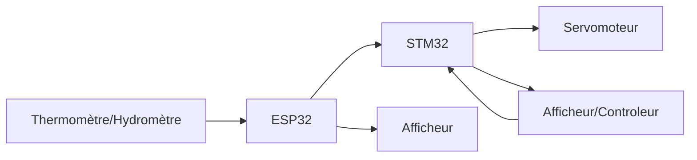
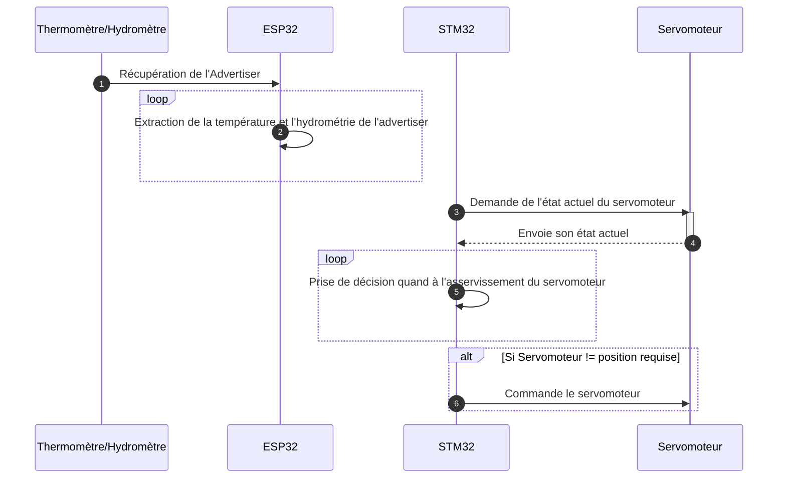

# Projet Domotique

## Contexte

Dans l'optique d'assimiler les concepts d'environnements intelligents et communiquants, un cas de test de type "domotique" a été retenu.   
L'objectif est dans mettre en oeuvre une version simple et allegée d'un système domotique domestique.  
Le système devra comprendre la lecture d'un capteur de température et d'hydrométrie pour ensuite commander l'asservissement d'une bouche d'aération que l'on pourrait retrouver dans une salle d'eau par exemple.  

## Schéma d'architecture

## Schéma de Principe

## ESP32 : Récupération des valeurs

## STM32 : Asservissement du servomoteur